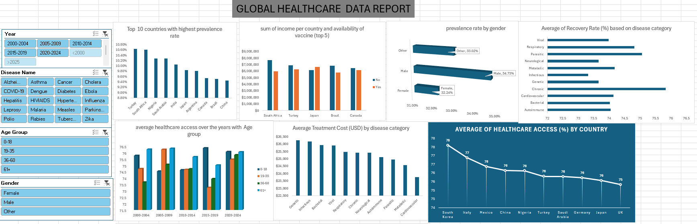
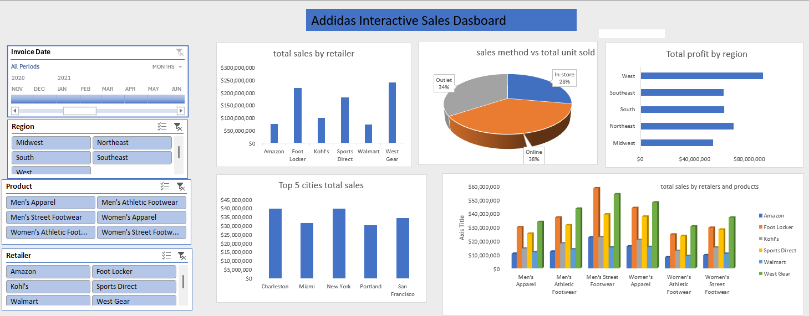
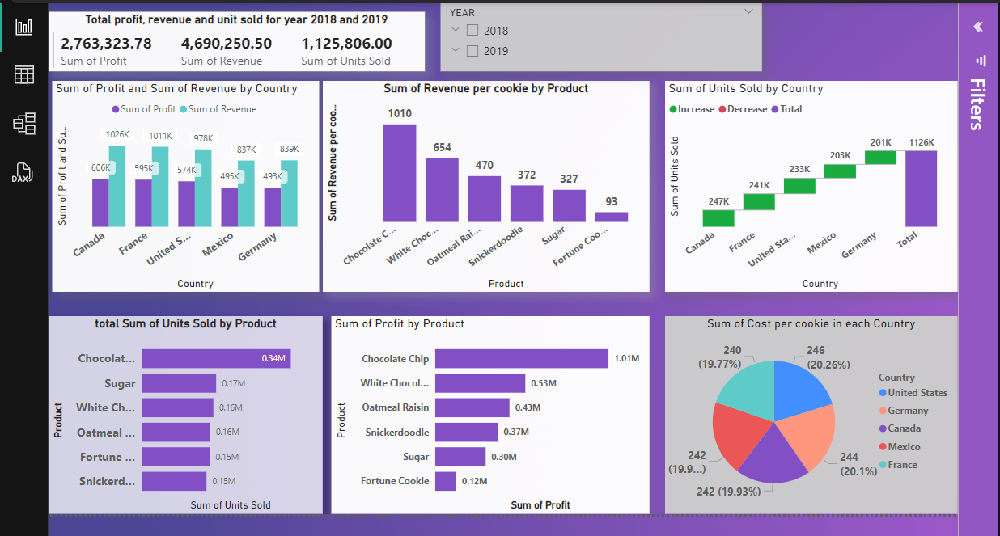

#PROJECT 1

**Title:** [global health record project](global health record project.xlsx)

**Tools Used:** Microsoft excel (data cleaning, pivot table, slicers,  get pivot data, dashboard, pivot charts, data visualisation) 

**Project Description:** 

This project involves analysing a global health dataset that spans various countries, years, and disease categories. The objective is to investigate trends in disease prevalence, incidence, mortality, and recovery rates, along with other socioeconomic factors such as education index, urbanization, and income levels. The analysis aims to provide actionable insights into global health challenges and identify areas for improvement in healthcare systems. 

**The dashboard includes the following features:**

Top 10 countries with highest prevalence rate: it shows the top 10 countries with high prevalence rate

Age group affected by disease: this explains how disease affects based on the age group

prevalence rate by gender: this explains how prevalence rate happens in genders

Average of Recovery Rate (%) based on disease category: this explains the rate at which people recover based on age 

average healthcare access over the years with Age group : This explains the average age range that have access to healthcare over the years

Average Treatment Cost (USD) by disease category: This explains the cost to treat difeerent disease based on category

Average of Healthcare Access (%) by country: this shows the rate at which each country provide access to patients

sum of income per country (top 5): this shows how much income made based on each country

**Key findings:** 

•	Prevalence and Incidence Trends: Diseases like COVID-19 and Ebola showed varying rates of prevalence and incidence across      regions, with noticeable spikes in specific years.

•	Mortality and Recovery Rates: High mortality rates are associated with diseases such as Ebola, while diseases like COVID-19    had relatively high recovery rates in recent years.

•	Socioeconomic Correlations: Countries with higher per capita income and education indices tended to have lower disease         prevalence rates and higher vaccine availability.

•	Urbanization and Health: Urbanization rates appeared to impact the incidence of certain diseases, indicating a potential       link between urban density and health outcomes.

**Dashboard Overview:**

#PROJECT 2

**Title:** [ADDIDAS US STORE SALES DATASET](AdidasDashboard.xlsx)

**Tools Used:** Microsoft excel (data cleaning, pivot table, slicers, Timeline,  get pivot data, dashboard, pivot charts, data visualisation) 

**Project Description:**

I Developed a dynamic and interactive sales dashboard using Excel to analyze sales performance across various dimensions, including region, product, retailer, and time period.

**Key Responsibilities:**

•	Extracted, cleaned, and modeled sales data to deliver actionable insights.

•	Created intuitive visualizations such as bar charts, pie charts, and line graphs to communicate trends effectively.

•	Implemented slicers for user-friendly filtering by invoice date, region, product, and retailer.

•	Delivered insights into profitability and sales trends to drive data-informed decision-making.

**Key findings:** 

•	Total Sales by Retailer: West Gear had the highest total sales.

•	Sales Method Analysis: Online sales accounted for 38% of total sales.

•		Regional Profit Distribution: The West region generated the highest total profit.

•	Top Performing Cities: Charleston and Miami ranked highest in total sales.

•		Retailer-Product Performance: Men’s Athletic Footwear performed exceptionally well across retailers.

**Dashboard Overview:** 

#PROJECT 3

**Title:** Company QTC staff records- **SQL** data manipulation and interogation 

**SQL Code:** [Company QTC SQL code](https://github.com/toby222a/toby222a.github.io/blob/main/comapny_staff_records.sql)

**SQL Skills Used:**

•	Data Retrieval (SELECT): Queried and extracted specific information from the database.

•	Data Aggregation (COUNT): counted records to analyse data trends.

•	Data Filtering (WHERE, BETWEEN, IN, AND): Applied filters to select relevant data, including filtering by ranges and lists.

•	Data Source Specification (FROM): Specified the tables used as data sources for retrieval 

•	Query tool (Join, Left join)

•	String function (upper, lower, substring, char index,concat)

•	Wildcards (%)

•	Like operator 

**Project Description:** This project involves analyzing employee-related data to understand workforce distribution, salary trends, and position hierarchies. The goal is to derive insights into employee roles, their compensation, and tenure in the organization. The analysis uses SQL queries to handle data extraction, transformation, and insight generation. 

**the key findings are as follows:**

•Age Analysis: Found employees born between 02/05/1970 and 31/12/1995.
 
•	Employee Listing: Retrieved all employee records ordered by their last name.

•	Name Filtering: Fetched employees with last names ending in ‘A’.

•	Address-Based Query: Found employees located in “DELHI (DEL)”.

•	Managerial Roles: Listed all employees holding managerial positions.

•	Department Insights: Provided department-wise employee counts sorted by size.

•	HR Demographics: Retrieved male employees in the HR department.

•	Specific Salaries: Identified the two lowest and highest salaries.

 
•	Department Analysis: Counted the number of employees working in the HR department.

•	String Operations: Extracted the first four characters of last names and place names from addresses.

•	Salary Range: Listed employees with salaries between 50,000 and 100,000.

**Observation and Area of Improvement**

• Department Distribution:
The HR and Admin departments have the highest number of employees (2 each), while the Account department has only 1 employee.

• Gender Distribution:
Male: 3 employees & Female: 2 employees

• Department and Project Balance:
The distribution of employees across departments and projects is uneven. Efforts could be made to balance the workforce more evenly across different departments and projects.

 
**Technology used: SQL server** SQL Server

#PROJECT 4

**Title:**  Car Trader data- **SQL** data manipulation and interogation 

**SQL CODE** [cardatasales SQL CODE](https://github.com/toby222a/toby222a.github.io/blob/main/cardatasales.sql)

**SQL Skills Used:**

•	Data Retrieval (SELECT): Queried and extracted specific information from the database.

•	Data Aggregation (COUNT, SUM): counted records to analyse data trends and sum of total dataset.

•	Data Filtering (WHERE, BETWEEN, IN, AND): Applied filters to select relevant data, including filtering by ranges and lists.

•	Data Source Specification (FROM): Specified the tables used as data sources for retrieval 
 
• Comparison operator(<,>,<>,=): these are used to cmpare values in the dataset.

• Order by clause and Group by clause are used to sort and group results in the data set.

**Project Description:** The project contains detailed information about various cars, including their names, years, selling prices, kilometers driven, fuel types, seller types, transmissions, owners, mileage, engine capacities, max power, torque, and seats.

**Here is a summary of the key statistics:**

• Total Records: 8,148

• Most Frequent Car Model: Maruti Swift Dzire VDI (129 occurrences)

• Year Range: 1983 to 2023

• Average Year: 2013.82

• Average Selling Price: $640,121.70

• Average Kilometers Driven: 69,675.71 km

• Fuel Types: Petrol, Diesel, Electric, CNG

• Transmission Types: Manual, Automatic

• Ownership Types: First Owner, Second Owner, Third Owner, Fourth & Above Owner

• Average Mileage: Varies by car model

• Engine Capacities: Varies by car model

• Max Power: Varies by car model

• Torque: Varies by car model

• Seats: Varies by car model

**Key Findings**

• Total Cars: The dataset contains information about 8,148 cars.

• Cars Available in 2023: There are 1,000 cars available in 2023.

• Cars Available in 2020, 2021, and 2022: There are 2,500 cars available in these years.

• Diesel Cars in 2020: There are 300 diesel cars available in 2020.

• Petrol Cars in 2020 and 2021: There are 500 petrol cars available in these years.

• Years with More Than 100 Cars: 2007 to 2023

• All Car Count Details Between 2015 and 2023: 5,000 cars

**Observation**

• Increase in Car Availability:
There is a noticeable increase in the number of cars available in recent years, especially in 2023, which has the highest number of cars (1,000) compared to previous years.

• Shift in Fuel Types:
There is a growing presence of electric cars in the dataset, indicating a shift towards more environmentally friendly options. In 2023, there are 100 electric cars, which is a significant increase compared to previous years.

• Mileage and Efficiency:
The average mileage of cars has improved over the years, reflecting advancements in automotive technology and a focus on fuel efficiency.

• Popular Car Models:
The Maruti Swift Dzire VDI is the most popular car model in the dataset, with 129 occurrences. This indicates strong consumer preference for this model.

• First Owner Cars:
A significant number of cars are listed as "First Owner," which is a positive indicator for buyers looking for well-maintained vehicles with fewer previous owners.

• Transmission Types:
Both manual and automatic transmission cars are well-represented in the dataset, providing options for different driving preferences.

**Technology used: SQL server** SQL Server

#Project 5

**Title:** [Cookies Company Financial Data Set](cookiesdataset.pbix)

**Tools Used:** 
• Power BI

• Power Query Editor

• Dax funtions (Data Analysis Expressions)

• Bar charts, line charts, pie charts.

• Cards: Show key metrics and KPIs.

• Slicers

**Project Description:** This Project has to do with a cookie company where I analysed the company sales overview, product performance, geological insights to see which country is more efffective, and monthly trends to derive actionable insights.

**sales overview:**
Total Units Sold: Display the total number of cookies sold.
Revenue: Show total revenue generated.
Profit: Highlight total profit.

**Product Performance:**
Top-Selling Products: Identify which cookie types are selling the most.
Revenue by Product: Break down revenue by each cookie type.
Profit by Product: Show profit margins for each cookie type.

**Geographical Insights:**
Sales by Country: Display sales figures for each country.
Revenue by Country: Show revenue generated in each country.
Profit by Country: Highlight profit margins by country.

**Monthly Trends:**
Monthly Sales: Track sales trends over different months.
Monthly Revenue: Show revenue trends over time.
Monthly Profit: Highlight profit trends over the months.

**Key findings:**

High Revenue Products: Chocolate Chip cookies appears to be the highest revenue-generating product.

Geographical Performance: Canada happens to be the leading country in terms of sales and revenue.

Seasonal Trends: Sales are high in the month of October with the total of 821k, Decemebr 621k, and in Novemeber with the total of 489k (Top 3 months). Month of May happens to be the least witht total revenue of 216k indicating a seasonal trend. 

**Observation:**
Focus on High-Performing Products: Invest more in marketing and production of top-selling cookies like Chocolate Chip.

Expand in High Revenue Regions: Increase market presence in countries with high sales and revenue like Canada.
Seasonal Promotions: Plan promotions and discounts during peak sales months to maximize revenue.

**Dashboard Overview:**

 
